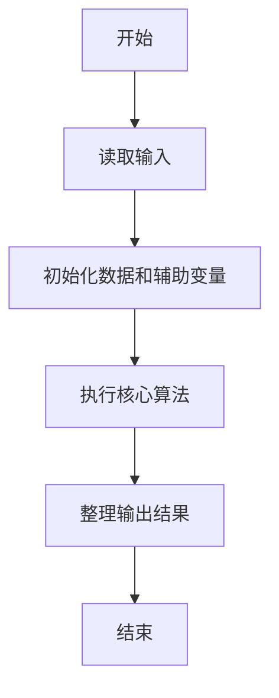
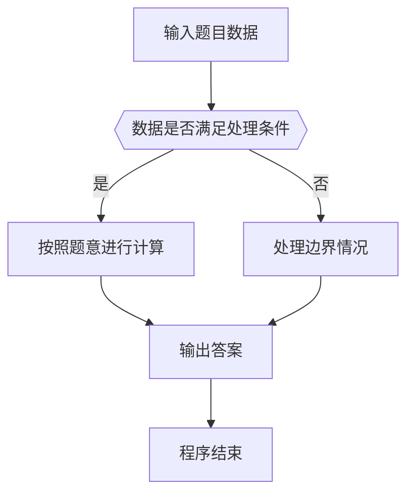

# 1012 数字分类

- **分值：** 20分

### 题目描述

给定一系列正整数，请按要求对数字进行分类，并输出以下 5 个数字：

- $A_1$ = 能被 5 整除的数字中所有偶数的和；
- $A_2$ = 将被 5 除后余 1 的数字按给出顺序进行交错求和，即计算 $n_1-n_2+n_3-n_4\cdots$；
- $A_3$ = 被 5 除后余 2 的数字的个数；
- $A_4$ = 被 5 除后余 3 的数字的平均数，精确到小数点后 1 位；
- $A_5$ = 被 5 除后余 4 的数字中最大数字。

### 输入格式：

每个输入包含 1 个测试用例。每个测试用例先给出一个不超过 1000 的正整数 $N$，随后给出 $N$ 个不超过 1000 的待分类的正整数。数字间以空格分隔。

### 输出格式：

对给定的 $N$ 个正整数，按题目要求计算 $A_1$～$A_5$ 并在一行中顺序输出。数字间以空格分隔，但行末不得有多余空格。

若分类之后某一类不存在数字，则在相应位置输出 `N`。

### 输入样例 1：
```
13 1 2 3 4 5 6 7 8 9 10 20 16 18
```

### 输出样例 1：
```
30 11 2 9.7 9
```

### 输入样例 2：
```
8 1 2 4 5 6 7 9 16
```

### 输出样例 2：
```
N 11 2 N 9
```


### 解题思路

本题的核心是：遍历数字，根据除 5 取余结果分别累加、计数或记录最大值。程序先读取题目输入，再按照上述规则完成数据处理，最后严格按照题目要求输出结果。实现时应优先根据题目约束选择合适的数据类型和数据结构，避免溢出或不必要的重复计算。

时间复杂度为 O(n)；空间复杂度取决于输入规模，主要用于保存题目数据和中间结果。

### 代码流程说明

1. 读取 1012 数字分类 所需的输入数据。
2. 初始化计数器、数组或其他辅助变量。
3. 遍历数字，根据除 5 取余结果分别累加、计数或记录最大值。
4. 按题目规定的格式输出计算结果。

### 代码实现

```python
# 实现原理：
# 本题的核心是：遍历数字，根据除 5 取余结果分别累加、计数或记录最大值。程序先读取题目输入，再按照上述规则完成数据处理，最后严格按照题目要求输出结果。实现时应优先根据题
# 目约束选择合适的数据类型和数据结构，避免溢出或不必要的重复计算。

# 代码流程：
# 1. 读取 1012 数字分类 所需的输入数据。
# 2. 初始化计数器、数组或其他辅助变量。
# 3. 遍历数字，根据除 5 取余结果分别累加、计数或记录最大值。
# 4. 按题目规定的格式输出计算结果。

# 读取输入并执行题目要求的算法。
import sys
t = iter(map(int, sys.stdin.buffer.read().split()))
n = next(t)
v = [0, 0, 0, 0, 0]
count1 = 0
total3 = 0
count3 = 0
for _ in range(n):
    x = next(t)
    r = x % 5
    if r == 0 and x % 2 == 0:
        v[0] += x
    elif r == 1:
        v[1] += x if count1 % 2 == 0 else -x
        count1 += 1
    elif r == 2:
        v[2] += 1
    elif r == 3:
        total3 += x
        count3 += 1
    elif r == 4:
        v[4] = max(v[4], x)
out = [
    str(v[0]) if v[0] else 'N',
    str(v[1]) if count1 else 'N',
    str(v[2]) if v[2] else 'N',
    f'{total3 / count3:.1f}' if count3 else 'N',
    str(v[4]) if v[4] else 'N',
]
print(' '.join(out))
```

### 代码流程图



### 解题流程图



### 常见易错点

- 注意输入数据的范围，选择足够大的整数类型，并正确处理边界值。
- 循环、数组下标和字符串结束位置要严格对应题目定义，避免越界。
- 输出格式必须与题目要求完全一致，包括空格、换行、大小写和特殊符号。
- 如果存在排序、去重、进位、约分或四舍五入等操作，应在输出前统一完成。
