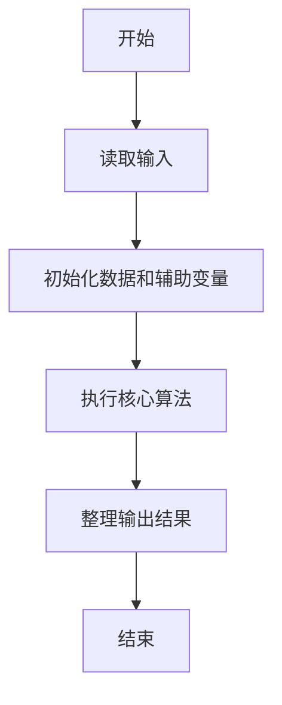
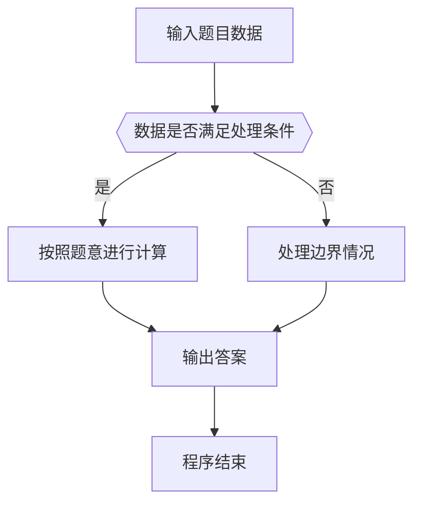

# 1025 反转链表

- **分值：** 25分

### 题目描述

给定一个常数 $K$ 以及一个单链表 $L$，请编写程序将 $L$ 中每 $K$ 个结点反转。例如：给定 $L$ 为 1→2→3→4→5→6，$K$ 为 3，则输出应该为 3→2→1→6→5→4；如果 $K$ 为 4，则输出应该为 4→3→2→1→5→6，即最后不到 $K$ 个元素不反转。

### 输入格式：

每个输入包含 1 个测试用例。每个测试用例第 1 行给出第 1 个结点的地址、结点总个数正整数 $N$（$N\le 10^5$）、以及正整数 $K$（$K\le N$），即要求反转的子链结点的个数。结点的地址是 5 位非负整数，NULL 地址用 $-1$ 表示。

接下来有 $N$ 行，每行格式为：
```
Address Data Next
```

其中 `Address` 是结点地址，`Data` 是该结点保存的整数数据，`Next` 是下一结点的地址。

### 输出格式：

对每个测试用例，顺序输出反转后的链表，其上每个结点占一行，格式与输入相同。

### 输入样例：
```
00100 6 4
00000 4 99999
00100 1 12309
68237 6 -1
33218 3 00000
99999 5 68237
12309 2 33218
```

### 输出样例：
```
00000 4 33218
33218 3 12309
12309 2 00100
00100 1 99999
99999 5 68237
68237 6 -1
```


### 解题思路

本题的核心是：读取链表后按给定长度分组，逐组反转并重新连接。程序先读取题目输入，再按照上述规则完成数据处理，最后严格按照题目要求输出结果。实现时应优先根据题目约束选择合适的数据类型和数据结构，避免溢出或不必要的重复计算。

时间复杂度为 O(n)；空间复杂度取决于输入规模，主要用于保存题目数据和中间结果。

### 代码流程说明

1. 读取 1025 反转链表 所需的输入数据。
2. 初始化计数器、数组或其他辅助变量。
3. 读取链表后按给定长度分组，逐组反转并重新连接。
4. 按题目规定的格式输出计算结果。

### 代码实现

```python
# 实现原理：
# 本题的核心是：读取链表后按给定长度分组，逐组反转并重新连接。程序先读取题目输入，再按照上述规则完成数据处理，最后严格按照题目要求输出结果。实现时应优先根据题目约束选择合
# 适的数据类型和数据结构，避免溢出或不必要的重复计算。

# 代码流程：
# 1. 读取 1025 反转链表 所需的输入数据。
# 2. 初始化计数器、数组或其他辅助变量。
# 3. 读取链表后按给定长度分组，逐组反转并重新连接。
# 4. 按题目规定的格式输出计算结果。

# 读取输入并执行题目要求的算法。
import sys
t = iter(sys.stdin.buffer.read().split())
head, n, k = (next(t).decode(), int(next(t)), int(next(t)))
nodes = {}
for _ in range(n):
    ad, value, nxt = (next(t).decode(), next(t).decode(), next(t).decode())
    nodes[ad] = (value, nxt)
order = []
p = head
while p != '-1':
    order.append(p)
    p = nodes[p][1]
for i in range(0, len(order) - k + 1, k):
    order[i:i + k] = order[i:i + k][::-1]
for i, p in enumerate(order):
    print(p, nodes[p][0], order[i + 1] if i + 1 < len(order) else '-1')
```

### 代码流程图



### 解题流程图



### 常见易错点

- 注意输入数据的范围，选择足够大的整数类型，并正确处理边界值。
- 循环、数组下标和字符串结束位置要严格对应题目定义，避免越界。
- 输出格式必须与题目要求完全一致，包括空格、换行、大小写和特殊符号。
- 如果存在排序、去重、进位、约分或四舍五入等操作，应在输出前统一完成。
