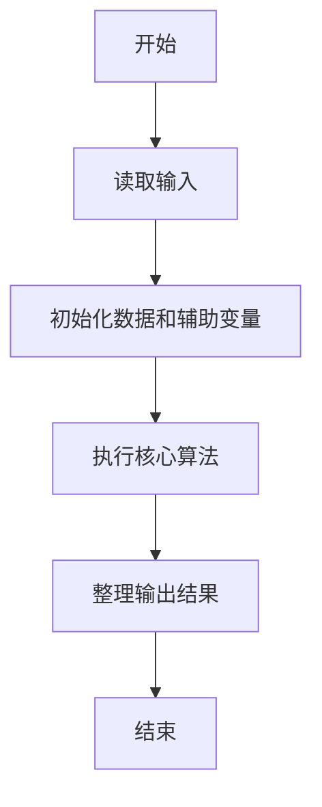
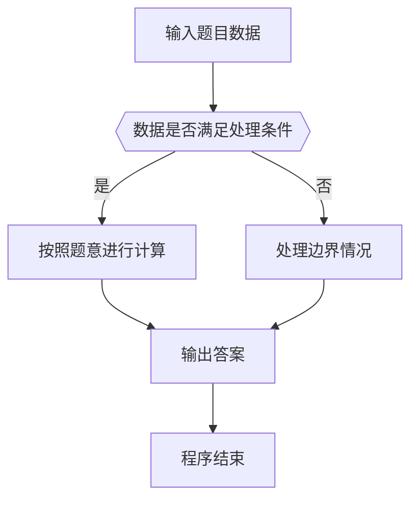

# 1050 螺旋矩阵

- **分值：** 25分

### 题目描述

本题要求将给定的 $N$ 个正整数按非递增的顺序，填入“螺旋矩阵”。所谓“螺旋矩阵”，是指从左上角第 1 个格子开始，按顺时针螺旋方向填充。要求矩阵的规模为 $m$ 行 $n$ 列，满足条件：$m\times n$ 等于 $N$；$m\ge n$；且 $m-n$ 取所有可能值中的最小值。

### 输入格式：

输入在第 1 行中给出一个正整数 $N$，第 2 行给出 $N$ 个待填充的正整数。所有数字不超过 $10^4$，相邻数字以空格分隔。

### 输出格式：

输出螺旋矩阵。每行 $n$ 个数字，共 $m$ 行。相邻数字以 1 个空格分隔，行末不得有多余空格。

### 输入样例：
```
12
37 76 20 98 76 42 53 95 60 81 58 93
```

### 输出样例：
```
98 95 93
42 37 81
53 20 76
58 60 76
```


### 解题思路

本题的核心是：将数据降序排序后按上、右、下、左四个方向填入矩阵。程序先读取题目输入，再按照上述规则完成数据处理，最后严格按照题目要求输出结果。实现时应优先根据题目约束选择合适的数据类型和数据结构，避免溢出或不必要的重复计算。

时间复杂度为 O(n log n)；空间复杂度取决于输入规模，主要用于保存题目数据和中间结果。

### 代码流程说明

1. 读取 1050 螺旋矩阵 所需的输入数据。
2. 初始化计数器、数组或其他辅助变量。
3. 将数据降序排序后按上、右、下、左四个方向填入矩阵。
4. 按题目规定的格式输出计算结果。

### 代码实现

```python
# 实现原理：
# 本题的核心是：将数据降序排序后按上、右、下、左四个方向填入矩阵。程序先读取题目输入，再按照上述规则完成数据处理，最后严格按照题目要求输出结果。实现时应优先根据题目约束选
# 择合适的数据类型和数据结构，避免溢出或不必要的重复计算。

# 代码流程：
# 1. 读取 1050 螺旋矩阵 所需的输入数据。
# 2. 初始化计数器、数组或其他辅助变量。
# 3. 将数据降序排序后按上、右、下、左四个方向填入矩阵。
# 4. 按题目规定的格式输出计算结果。

# 读取输入并执行题目要求的算法。
import sys
t = iter(map(int, sys.stdin.buffer.read().split()))
n = next(t)
a = sorted((next(t) for _ in range(n)), reverse=True)
cols = max((d for d in range(1, int(n ** 0.5) + 1) if n % d == 0))
rows = n // cols
mat = [[0] * cols for _ in range(rows)]
top, bottom, left, right, k = (0, rows - 1, 0, cols - 1, 0)
while top <= bottom and left <= right:
    for j in range(left, right + 1):
        mat[top][j], k = (a[k], k + 1)
    top += 1
    for i in range(top, bottom + 1):
        mat[i][right], k = (a[k], k + 1)
    right -= 1
    if top <= bottom:
        for j in range(right, left - 1, -1):
            mat[bottom][j], k = (a[k], k + 1)
        bottom -= 1
    if left <= right:
        for i in range(bottom, top - 1, -1):
            mat[i][left], k = (a[k], k + 1)
        left += 1
for row in mat:
    print(*row)
```

### 代码流程图



### 解题流程图



### 常见易错点

- 注意输入数据的范围，选择足够大的整数类型，并正确处理边界值。
- 循环、数组下标和字符串结束位置要严格对应题目定义，避免越界。
- 输出格式必须与题目要求完全一致，包括空格、换行、大小写和特殊符号。
- 如果存在排序、去重、进位、约分或四舍五入等操作，应在输出前统一完成。
