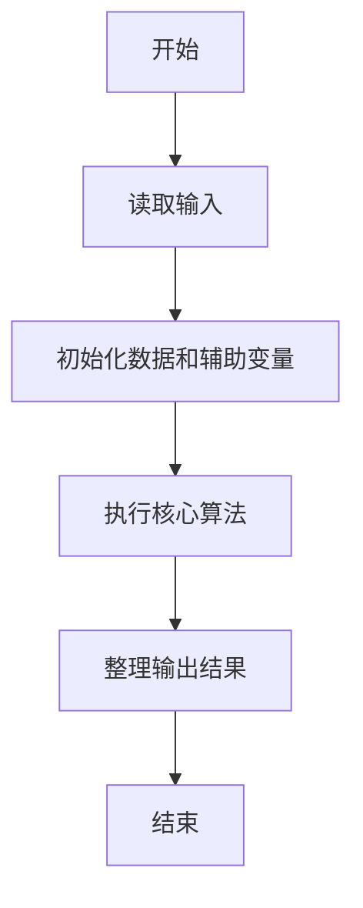
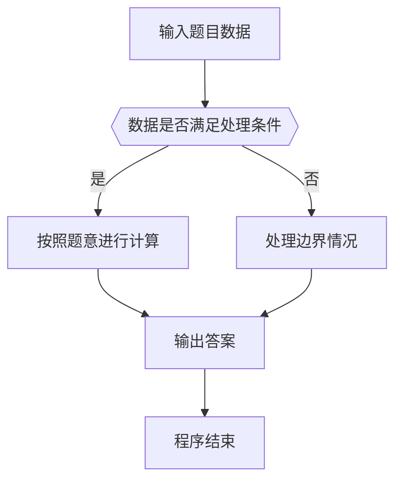

# 1052 卖个萌

- **分值：** 20分

### 题目描述

萌萌哒表情符号通常由“手”、“眼”、“口”三个主要部分组成。简单起见，我们假设一个表情符号是按下列格式输出的：
```
[左手]([左眼][口][右眼])[右手]
```
现给出可选用的符号集合，请你按用户的要求输出表情。

### 输入格式：

输入首先在前三行顺序对应给出手、眼、口的可选符号集。每个符号括在一对方括号 `[]`内。题目保证每个集合都至少有一个符号，并不超过 10 个符号；每个符号包含 1 到 4 个非空字符。

之后一行给出一个正整数 $K$，为用户请求的个数。随后 $K$ 行，每行给出一个用户的符号选择，顺序为左手、左眼、口、右眼、右手——这里只给出符号在相应集合中的序号（从 1 开始），数字间以空格分隔。

### 输出格式：

对每个用户请求，在一行中输出生成的表情。若用户选择的序号不存在，则输出 `Are you kidding me? @\\/@`。

### 输入样例：
```
[╮][╭][o][~\][/~]  [<][>]
 [╯][╰][^][-][=][>][<][@][⊙]
[Д][▽][_][ε][^]  ...
4
1 1 2 2 2
6 8 1 5 5
3 3 4 3 3
2 10 3 9 3

```

### 输出样例：
```
╮(╯▽╰)╭
<(@Д=)/~
o(^ε^)o
Are you kidding me? @\\/@
```


### 解题思路

本题的核心是：读取手、眼、口三个符号集合，按编号校验并拼接成表情。程序先读取题目输入，再按照上述规则完成数据处理，最后严格按照题目要求输出结果。实现时应优先根据题目约束选择合适的数据类型和数据结构，避免溢出或不必要的重复计算。

时间复杂度为 O(L)；空间复杂度取决于输入规模，主要用于保存题目数据和中间结果。

### 代码流程说明

1. 读取 1052 卖个萌 所需的输入数据。
2. 初始化计数器、数组或其他辅助变量。
3. 读取手、眼、口三个符号集合，按编号校验并拼接成表情。
4. 按题目规定的格式输出计算结果。

### 代码实现

```python
# 实现原理：
# 本题的核心是：读取手、眼、口三个符号集合，按编号校验并拼接成表情。程序先读取题目输入，再按照上述规则完成数据处理，最后严格按照题目要求输出结果。实现时应优先根据题目约束
# 选择合适的数据类型和数据结构，避免溢出或不必要的重复计算。

# 代码流程：
# 1. 读取 1052 卖个萌 所需的输入数据。
# 2. 初始化计数器、数组或其他辅助变量。
# 3. 读取手、眼、口三个符号集合，按编号校验并拼接成表情。
# 4. 按题目规定的格式输出计算结果。

# 读取输入并执行题目要求的算法。
import sys
lines = sys.stdin.buffer.read().decode().rstrip('\n').splitlines()

def parse(s):
    return [part.split(']')[0] for part in s.split('[')[1:]]
h, e, m = map(parse, lines[:3])
n = int(lines[3])
for line in lines[4:4 + n]:
    v = list(map(int, line.split()))
    valid = (
        len(v) == 5
        and 1 <= v[0] <= len(h)
        and 1 <= v[1] <= len(e)
        and 1 <= v[2] <= len(m)
        and 1 <= v[3] <= len(e)
        and 1 <= v[4] <= len(h)
    )
    if not valid:
        print('Are you kidding me? @\\\\/@')
    else:
        print(f'{h[v[0] - 1]}({e[v[1] - 1]}{m[v[2] - 1]}{e[v[3] - 1]}){h[v[4] - 1]}')
```

### 代码流程图



### 解题流程图



### 常见易错点

- 注意输入数据的范围，选择足够大的整数类型，并正确处理边界值。
- 循环、数组下标和字符串结束位置要严格对应题目定义，避免越界。
- 输出格式必须与题目要求完全一致，包括空格、换行、大小写和特殊符号。
- 如果存在排序、去重、进位、约分或四舍五入等操作，应在输出前统一完成。
