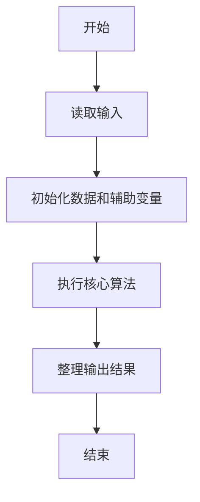
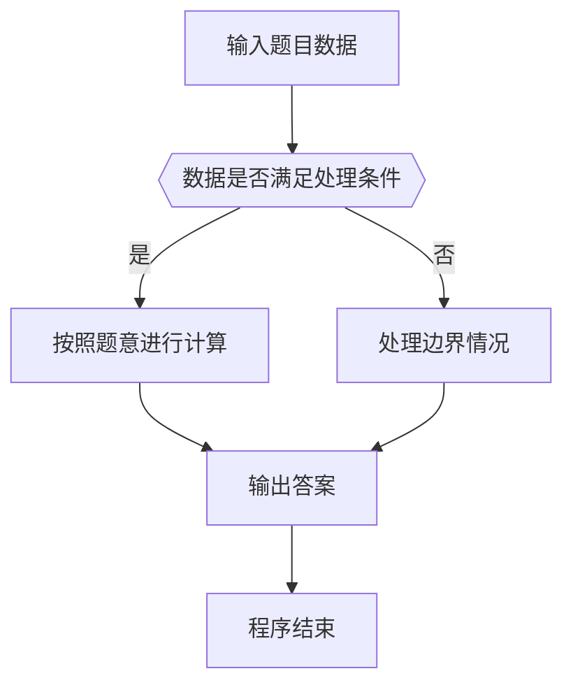

# 1104 天长地久

- **分值：** 20分

### 题目描述

“天长地久数”是指一个 $K$ 位正整数 $A$，其满足条件为：$A$ 的各位数字之和为 $m$，$A+1$ 的各位数字之和为 $n$，且 $m$ 与 $n$ 的最大公约数是一个大于 2 的素数。本题就请你找出这些天长地久数。

### 输入格式：

输入在第一行给出正整数 $N$（$\le 5$），随后 $N$ 行，每行给出一对 $K$（$3<K<10$）和 $m$（$1<m<90$），其含义如题面所述。

### 输出格式：

对每一对输入的 $K$ 和 $m$，首先在一行中输出 `Case X`，其中 `X` 是输出的编号（从 1 开始）；然后一行输出对应的 $n$ 和 $A$，数字间以空格分隔。如果解不唯一，则每组解占一行，按 $n$ 的递增序输出；若仍不唯一，则按 $A$ 的递增序输出。若解不存在，则在一行中输出 `No Solution`。

### 输入样例：
```
2
6 45
7 80
```

### 输出样例：
```
Case 1
10 189999
10 279999
10 369999
10 459999
10 549999
10 639999
10 729999
10 819999
10 909999
Case 2
No Solution
```


### 解题思路

本题的核心是：按位数枚举候选 A，计算 A 与 A+1 的数位和，检查两者最大公约数是否为大于 2 的素数。程序先读取题目输入，再按照上述规则完成数据处理，最后严格按照题目要求输出结果。实现时应优先根据题目约束选择合适的数据类型和数据结构，避免溢出或不必要的重复计算。

时间复杂度为 O(10^K K)；空间复杂度取决于输入规模，主要用于保存题目数据和中间结果。

### 代码流程说明

1. 读取 1104 天长地久 所需的输入数据。
2. 初始化计数器、数组或其他辅助变量。
3. 按位数枚举候选 A，计算 A 与 A+1 的数位和，检查两者最大公约数是否为大于 2 的素数。
4. 按题目规定的格式输出计算结果。

### 代码实现

```python
# 实现原理：
# 本题的核心是：按位数枚举候选 A，计算 A 与 A+1 的数位和，检查两者最大公约数是否为大于 2
# 的素数。程序先读取题目输入，再按照上述规则完成数据处理，最后严格按照题目要求输出结果。实现时应优先根据题目约束选择合适的数据类型和数据结构，避免溢出或不必要的重复计算。

# 代码流程：
# 1. 读取 1104 天长地久 所需的输入数据。
# 2. 初始化计数器、数组或其他辅助变量。
# 3. 按位数枚举候选 A，计算 A 与 A+1 的数位和，检查两者最大公约数是否为大于 2 的素数。
# 4. 按题目规定的格式输出计算结果。

# 读取输入并执行题目要求的算法。
import sys, math

def ds(x):
    return sum(map(int, str(x)))

def prime(x):
    return x >= 2 and all((x % d for d in range(2, int(x ** 0.5) + 1)))

def numbers(length, total):

    def dfs(pos, left, value):
        if pos == length:
            if left == 0:
                yield value
            return
        for digit in range(10):
            if pos == 0 and digit == 0:
                continue
            if left >= digit and left - digit <= 9 * (length - pos - 1):
                yield from dfs(pos + 1, left - digit, value * 10 + digit)
    yield from dfs(0, total, 0)
t = iter(map(int, sys.stdin.buffer.read().split()))
for case in range(1, next(t) + 1):
    k, m = (next(t), next(t))
    print(f'Case {case}')
    ans = []
    for trailing in range(1, k):
        prefix_sum = m - 9 * trailing
        if prefix_sum < 1:
            continue
        nxt = m - 9 * trailing + 1
        g = math.gcd(m, nxt)
        if g > 2 and prime(g):
            ans += [(nxt, a * 10 ** trailing + (10 ** trailing - 1)) for a in numbers(k - trailing, prefix_sum)]
    for nxt, a in sorted(ans):
        print(nxt, a)
    if not ans:
        print('No Solution')
```

### 代码流程图



### 解题流程图



### 常见易错点

- 注意输入数据的范围，选择足够大的整数类型，并正确处理边界值。
- 循环、数组下标和字符串结束位置要严格对应题目定义，避免越界。
- 输出格式必须与题目要求完全一致，包括空格、换行、大小写和特殊符号。
- 如果存在排序、去重、进位、约分或四舍五入等操作，应在输出前统一完成。
